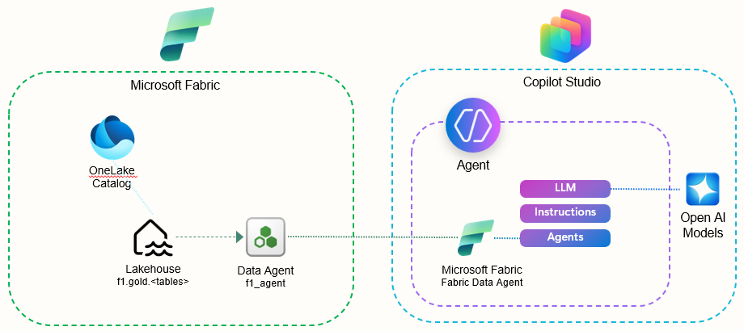

# f1fabric

## Overview
I decided to create a fun Formula 1 demo dataset for showcasing the integration between Fabric Data Agents & Microsoft Copilot and/or AI Foundry.  There are a lot of datasets out there and this one is inspired by the initial work done by [Shubham Yadav](https://www.linkedin.com/in/shubham-utdallas/) a few years ago.  Unfortunately the data source he references is no longer available.  Thus, I did some searching and found the [kaggle - Formula 1 Race Data](https://www.kaggle.com/datasets/jtrotman/formula-1-race-data/data).  This dataset is updated after each F1 race and using the solution I created in this repo, you can easily update the medallion architecture on a weekly basis during race season.

To do so, perform the following:
1. Create a brand new Fabric Workspace.
2. Clone this repo to your GitHub environment.
3. Add your newly cloned GitHub repo to your Fabric Workspace environment via the Git integration under Workspace settings. For more on this topic, check out [Connect a workspace to a Git repo - GitHub Connect](https://learn.microsoft.com/en-us/fabric/cicd/git-integration/git-get-started?tabs=azure-devops%2CGitHub%2Ccommit-to-git#connect-a-workspace-to-a-git-repo).
4. Within your Fabric Workspace, perform an Update under Source Control to pull the Lakehouse, Notebooks and Data Agent into your newly created workspace.  For more on this topic, check out [Basic concepts in Git integration - Commits and updates](https://learn.microsoft.com/en-us/fabric/cicd/git-integration/git-integration-process?tabs=Azure%2Cazure-devops#commits-and-updates).

## Fabric Workspace Components
This repository contains the following items that will be deposited into your workspace once you perform the Update via Source Control.
- F1 Lakehouse with schema enabled
- Silver - All Tables: This notebook takes the .csv files that are uploaded to the Lakehouse files from Kaggle and transforms them into delta tables in the Silver schema.  There are two variables to update in the notebook to point to the information for your environment.
    1. bronze_file_path - Set this to match your bronze volume path.
    2. silver_schema - Set this to match your LAKEHOUSE.SCHEMA for your silver environment.
- Gold - All Tables: This notebook transforms all the tables into the Silver schema to delta tables that act as materialized views in the Gold schema.  There are two variables to update in the notebook to point to the information for your environment.
    1. silver_schema - Set this to match your LAKEHOUSE.SCHEMA for your silver environment.
    2. gold_schema - Set this to match your LAKEHOUSE.SCHEMA for your silver environment.
- f1_agent: This is a Fabric Data Agent that utilizes the tables in the f1.gold schema as it's data source.  It also includes a Data Source Description, Data Source Instructions, and Agent Instructions.   

## Kaggle F1 Data
You will need to download the .zip file from the [kaggle - Formula 1 Race Data](https://www.kaggle.com/datasets/jtrotman/formula-1-race-data/data) web site.  It contains the following csv files.
- circuits.csv
- constructor_results.csv
- constructor_standings.csv
- constructors.csv
- driver_standings.csv
- drivers.csv
- lap_times.csv
- pit_stops.csv
- qualifying.csv
- races.csv
- results.csv
- seasons.csv
- sprint_results.csv
- status.csv

Once these are downloaded and extracted on your local machine, you will need to upload the csv files to Files section of the F1 lakehouse within your Fabric workspace so that they can be utilized by the Fabric Notebooks in the next section.

###  Tips
For this repo, I created the following items in my F1 lakehouse.  The notebooks and the f1_agent data agent references are based on these items.
1. I created a bronze folder in my F1 Lakehouse Files and uploaded the csv files to this location.
2. I created 2 schemes under the lakehouse:
    a. silver
    b. gold

## AI Foundry and Copilot Studio using the Fabric Data Agent
You can also integrate this Fabric Data Agent with both AI Foundry and Copilot Studio.  For more on this topic check out the following articles:
- [Fabric Data Agents + Microsoft Copilot Studio: A New Era of Multi-Agent Orchestration (Preview)](https://blog.fabric.microsoft.com/en-US/blog/fabric-data-agents-microsoft-copilot-studio-a-new-era-of-multi-agent-orchestration/)
- {}()  
### Sample Architecture - Fabric Data Agents - Copilot Studio

### Sample Architecture - Fabric Data Agents - New AI Foundry

### Sample Architecture - Fabric Data Agents - Legacy AI Foundry  

